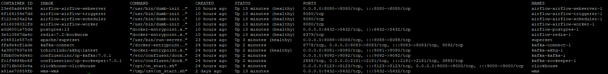
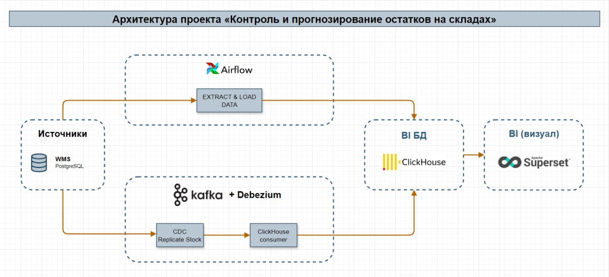
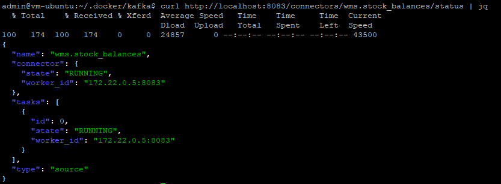
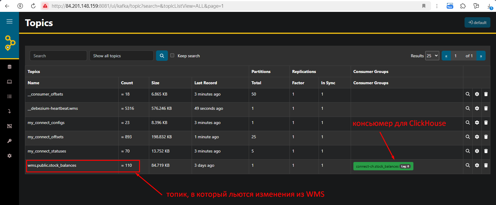
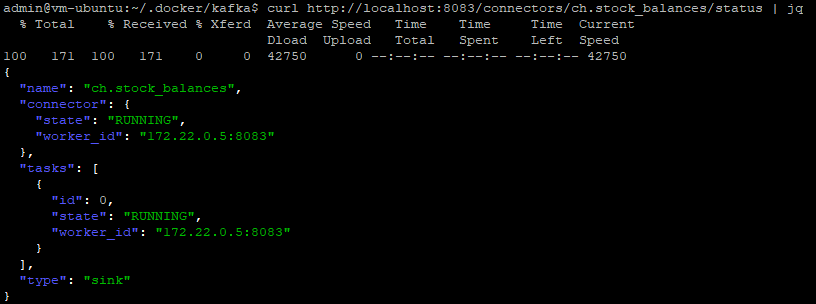
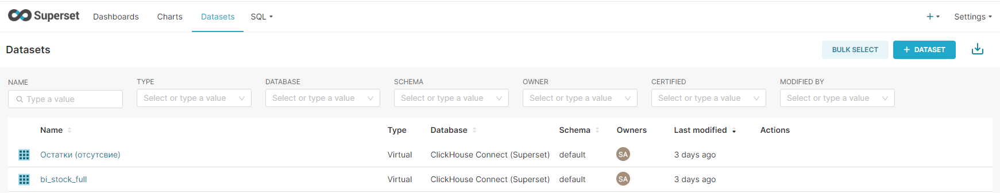
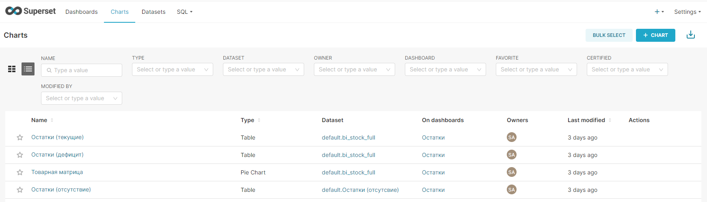
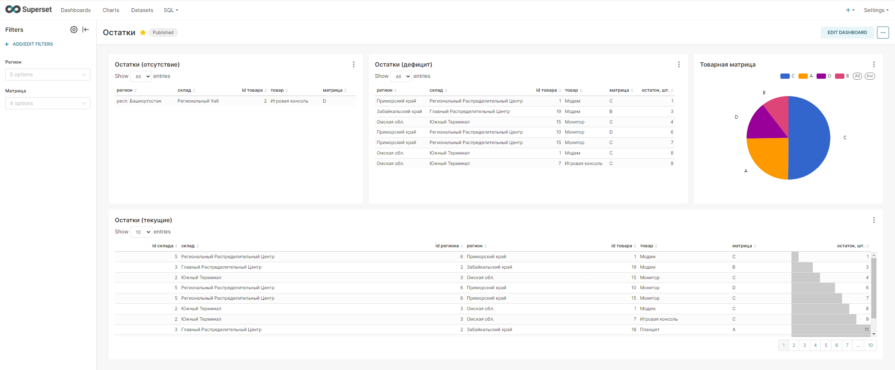

# Подготовка окружения

Вся архитектура разворачивалась на единственной облачной ВМ (Yandex Cloud).
Конфигурация ВМ:
- Платформа: Intel Ice Lake
- vCPU: 4
- HDD: 100 Гб
- OS: Ubuntu 20.04 LTS
- Гарантированная доля vCPU: 50%
- RAM: 16 Гб
- Прерываемая: нет

Внутри ВМ был поднят Docker (version 27.1.1, build 6312585).

После поднятия всех контейнеров список «docker ps» выглядит так:

<center><a href="screen/docker_ps.png" target="_blank"></a></center>

Копируем репозиторий в домашнюю директорию нашему пользователя (у меня это admin).
В итоге все файлы репозитория лежат тут: /home/admin/.docker/

# Что в итоге будем строить (архитектура)

<center><a href="screen/schema.jpg" target="_blank"></a></center>

Схема в формате drawio - <a href="screen/schema.jpg" target="_blank">тут</a>.
Открыть можно через web - <a href="https://app.diagrams.net/" target="_blank">https://app.diagrams.net/</a>

Сервисы:
- PostgreSQL (WMS система-источник - для хранения информации о товарах, их движении и остатках);
- Kafka (для потоковой передачи данных - изменения кол-ва остатка на складах);
- Airflow (для ETL процессов);
- ClickHouse (для хранения и анализа больших объемов данных о товародвижении и остатках);
- Superset (для построения дашбордов).

# 1. WMS

## Генерация данных, создание и наполнение таблиц

До того как поднять контейнер с БД PostgreSQL, необходимо подготовить данные.
Для генерации данных был создан python скрипт <a href="data_generator/data_generator.py" target="_blank">data_generator.py</a>, в котором при помощи библиотеки faker и были созданы данные:
- products.csv
- regions.csv
- warehouses.csv
- stock_balances.csv

## Запуск контейнера

Исходники лежат тут - <a href="wms/" target="_blank">wms</a>

Запускаем контейнер и заходим внутрь:
```
cd /home/admin/.docker/wms
docker compose up --build -d
docker exec -ti wms bash
```

Открываем для редактирования конфигурационный файл PG внутри контейнера:
```
vi /var/lib/postgresql/data/postgresql.conf
```
Применяем настройки для CDC:
- wal_level = logical
- max_wal_senders = 10
- max_replication_slots = 10

Перезапускаем сервер PG:
```
su - postgres
/usr/lib/postgresql/15/bin/pg_ctl restart -D /var/lib/postgresql/data
```

Сервер БД готов к работе.
Подключаемся через DBeaver к БД и проверяем наличие таблиц с данными (креды <a href="airflow/.env" target="_blank">тут</a>), только используем внешний IP.

## Особенности сборки

При запуске контейнера запускается скрипт <a href="wms/csv/on_start.sh" target="_blank">on_start.sh</a>,
который создаёт таблицы с ранее сгенеренными данными, которые в <a href="wms/csv" target="_blank">csv файлах</a>.

# 2. ClickHouse

Создаём и запускаем контейнер:
```
cd /home/admin/.docker/clickhouse
docker compose up --build -d
```

Подключаемся к базе default (креды <a href="airflow/.env" target="_blank">тут</a>) по внешнему IP через DBeaver по http порту 8123 и создаём ручками таблицы, в которые будут приезжать данные из WMS.
Для создания таблиц используем <a href="clickhouse/ddl.sql" target="_blank">ddl скрипт</a>.

# 3. Airflow

Создаём и запускаем контейнер:
```
cd /home/admin/.docker/airflow
docker compose up --build -d
```

## Особенности сборки

В директории <a href="airflow/dags" target="_blank">airflow/dags</a> находится DAG, который грузит ежедневно данные из WMS, всё кроме таблицы с остатками, т.е. справочную информацию, которая меняется редко (1 раза в сутки достаточно), в отличии от динамично изменяемых остатков. Последние будут обновляться в real-time режиме (см. CDC ниже).

# 4. Kafka + Debezium

## Настройка CDC в PG

Создаём роль и логин для Debezium клиента, который будет тянуть данные из WMS:
```
CREATE ROLE debezium WITH LOGIN PASSWORD 'debezium' REPLICATION;
GRANT CONNECT ON DATABASE wms TO debezium;
GRANT USAGE ON SCHEMA public TO debezium;
GRANT SELECT ON ALL TABLES IN SCHEMA public TO debezium;
```

## Создание и запуск контейнера

```
cd /home/admin/.docker/kafka
docker compose up --build -d
```
В сборке находится директория a href="kafka/plugins" target="_blank">plugins</a>, в которой лежат нужные классы коннекторов.

После поднятия контейнера можно проверить все ли классы на месте (в контейнер заходить не нужно, все запросы через curl):
```
curl http://localhost:8083 | jq
curl http://localhost:8083/connector-plugins | jq
```

## Создание коннекторов

Исходники коннекторов лежат тут:
- <a href="kafka/connectors/postgresql/stock_balances.json" target="_blank">kafka/connectors/postgresql/stock_balances.json</a> - репликация данных из PG в Kafka
- <a href="kafka/connectors/clickhouse/stock_balances.json" target="_blank">kafka/connectors/clickhouse/stock_balances.json</a> - поток данных из топика Kafka в ClickHouse

### Создаём wms коннектор
```
# внимание, путь к json коду коннектора относительный (в примере мы находимся в диреткории /home/admin/.docker/kafka)
curl -X POST -H "Content-Type: application/json" --data @./connectors/postgresql/stock_balances.json http://localhost:8083/connectors
```
Проверим статус коннектора:
```
curl http://localhost:8083/connectors/wms.stock_balances/status | jq
```
Должна быть такая картинка:

<center><a href="screen/kafka_wms_stock_balances_status.png" target="_blank"></a></center>

Результат работы коннектора видим в поднятом вместе с Kafka UI-сервисе akhq (можно выбрать любой другой на свой вкус):

<center><a href="screen/akhq.png" target="_blank"></a></center>

### Создаём ClickHouse коннектор

Нам нужно поднять ещё один коннектор, который будет забирать данные из созданного топика wms.public.stock_balances и отправлять сообщения в ClickHouse.

```
# внимание, путь к json коду коннектора относительный (в примере мы находимся в диреткории /home/admin/.docker/kafka)
curl -X POST -H "Content-Type: application/json" --data @./connectors/clickhouse/stock_balances.json http://localhost:8083/connectors
```
Проверим статус коннектора:
```
curl http://localhost:8083/connectors/ch.stock_balances/status | jq
```
Должна быть такая картинка:

<center><a href="screen/kafka_ch_stock_balances_status.png" target="_blank"></a></center>

Результат видим в подготовленно ранее таблице в ClickHouse - kafka_wms_stock_balances, а текущее состояние остатков представлено во вьюшке stock_balances_v.

В случае проблем, коннекторы можно удалить и заново создать:
```
# удаление wms коннектора (не класса)
curl -X DELETE http://localhost:8083/connectors/wms.stock_balances

# удаление ch коннектора (не класса)
curl -X DELETE http://localhost:8083/connectors/ch.stock_balances
```

На этапе настройка CDC завершена, можем приступать к BI.

# 5. Apache Superset

## Запуск контейнера

Для запуска Superset необходимо выполнить серию команд.
Команды можно запускать без sudo, если у вас (как у меня) пользователь добавлен в группу docker:

```
# скачиваем образ
docker pull apache/superset

# генеририм ключ SUPERSET_SECRET_KEY
openssl rand -base64 42

# запускаем контейнер
docker run -d -p 8080:8088 -e "SUPERSET_SECRET_KEY=your_secret_key_here" --name superset apache/superset

# инициализация инстанса Superset
docker exec -it superset superset fab create-admin \
          --username admin \
          --firstname Superset \
          --lastname Admin \
          --email admin@superset.com \
          --password admin

docker exec -it superset superset db upgrade
docker exec -it superset superset load_examples
docker exec -it superset superset init
```

Далее необходимо научить Superset работать с ClickHouse:
```
# заходим внутрь контейнера
docker exec -it superset bash

# устанавливаем python библиотеку для взаимодействия с CH
pip install clickhouse-connect
# или pip install clickhouse-sqlalchemy
# проверяем наличие ошибок в логе, если они есть.

# выходим из контейнера
exit

# перезапуск контейнера
docker restart superset
```

Superset готов к работе.

## Настройка дашборда

Датасет «bi_stock_full» - обогащенная данными вьюшка stock_balances_v, делаем широкую таблицу текущих остатков:
```
select
  s.warehouse_id as "id склада",
  coalesce(w.warehouse_name, '-- не определено --') as "склад",
  coalesce(r.region_id, 0) as "id региона",
  coalesce(r.region_name, '-- не определено --') as "регион",
  s.product_id as "id товара",
  coalesce(p.product_name, '-- не определено --') as "товар",
  coalesce(p.product_category, '-- не определено --') as "матрица",
  s.quantity as "остаток, шт."
from stock_balances_v s
left join warehouses w on w.warehouse_id = s.warehouse_id
left join regions r on r.region_id = w.region_id
left join products p on p.product_id = s.product_id
```

Датасет «Остатки (остутствие)» - запрос показывает отсутствие товара на складах:
```
with
-- полная товарная матрица по всем складам
matrix as (
  select
    r.region_id as region_id,
    r.region_name as region_name,
    w.warehouse_id as warehouse_id,
    w.warehouse_name as warehouse_name,
    p.product_id as product_id,
    p.product_name as product_name,
    p.product_category as product_category
  from warehouses w
  inner join regions r on r.region_id = w.region_id
  inner join products p on 1=1
)
select
  matrix.region_id as "id региона",
  matrix.region_name as "регион",
  matrix.warehouse_id as "id склада",
  matrix.warehouse_name as "склад",
  matrix.product_id as "id товара",
  matrix.product_name as "товар",
  matrix.product_category as "матрица"
from matrix
left join stock_balances_v s on s.warehouse_id = matrix.warehouse_id
  and s.product_id = matrix.product_id
where s.product_id is null or s.quantity = 0
```

Условие и сам запрос можно настроить под бизнес-требования. В данном примере, требование следующее - каждое SKU должно быть на каждом из имеющихся складах во всех регионах, собственно это данный запрос и контролирует.

### Скрины

Датасеты:
<center><a href="screen/superset_datasets.png" target="_blank"></a></center>

Чарты:
<center><a href="screen/superset_charts.png" target="_blank"></a></center>

Итоговый дашборд с фильтрами:
<center><a href="screen/superset_dashboard.png" target="_blank"></a></center>

